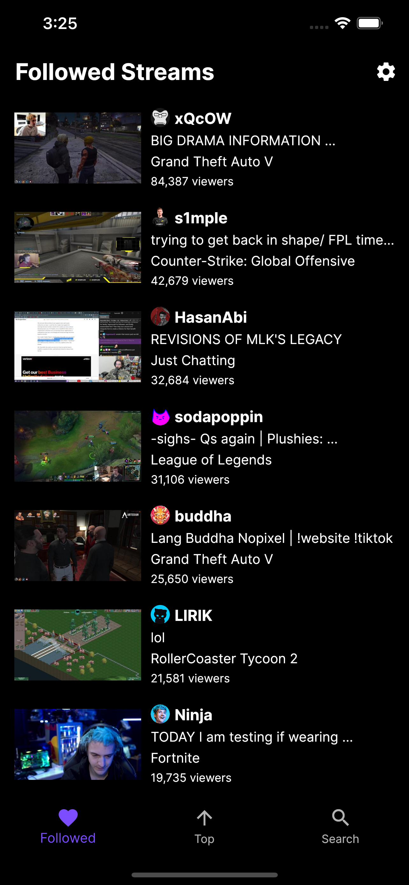
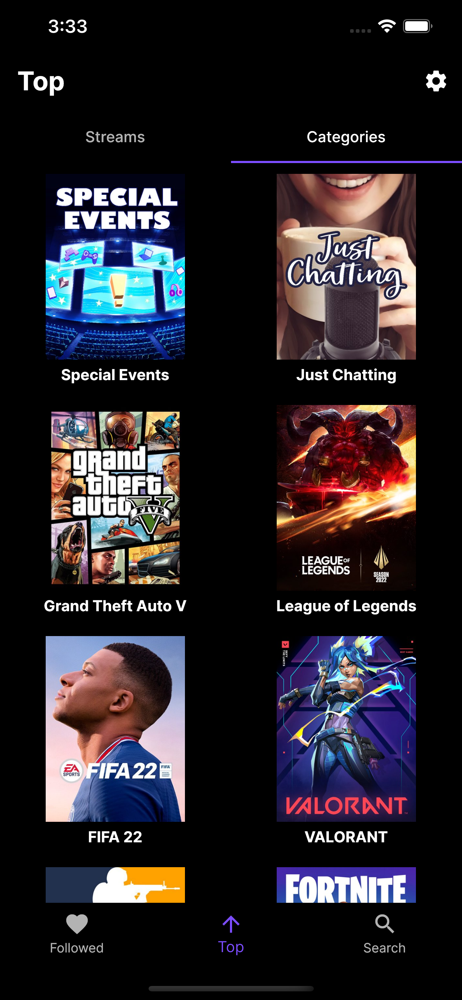
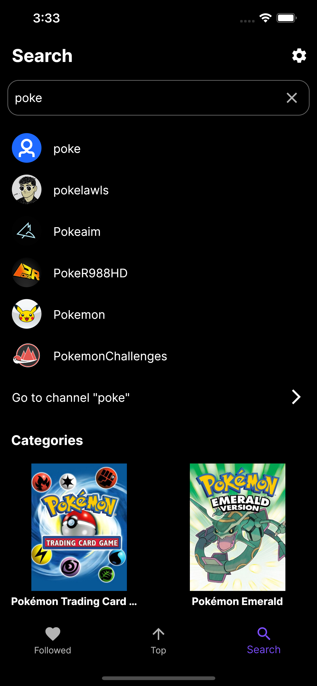
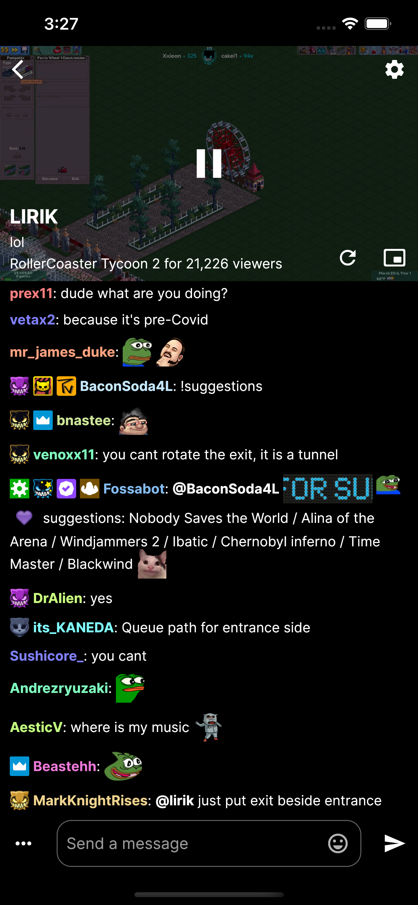
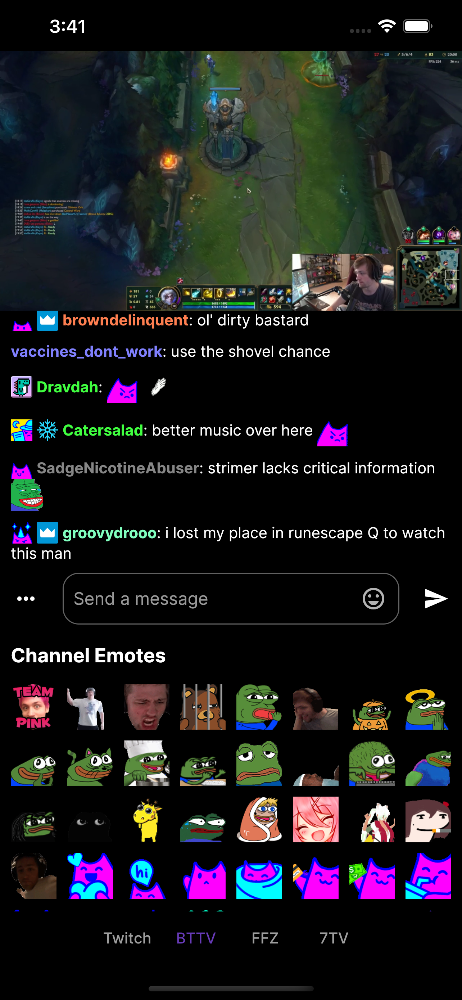
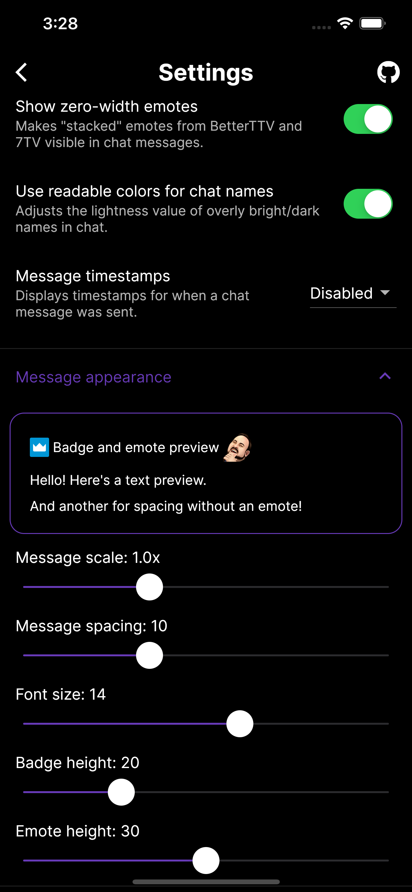

# Frosty

A [Twitch](https://www.twitch.tv/) client for iOS and Android, built with [Flutter](https://flutter.dev/).

    
    

## Features

- Browse followed streams, top streams, and top categories
- Search for channels and categories
- Watch live streams with chat
- Support for BTTV, FFZ, and 7TV emotes/badges
- View local chat user message history
- See the list of users in chat and filter them
- Theater and full-screen mode
- Block and unblock users
- Light, dark, and black (OLED) themes
- Customizable settings

## Screenshots

    
    
    

    
    
    

## Motivation

A major problem with the official Twitch app for many users is that emotes from services such as [BetterTTV (BTTV)](https://chrome.google.com/webstore/detail/betterttv/ajopnjidmegmdimjlfnijceegpefgped), [FrankerFaceZ (FFZ)](https://chrome.google.com/webstore/detail/frankerfacez/fadndhdgpmmaapbmfcknlfgcflmmmieb), and [7TV](https://chrome.google.com/webstore/detail/7tv/ammjkodgmmoknidbanneddgankgfejfh) are not officially supported. Twitch is unaffiliated with these services, hence why they haven't been integrated officially.

As a result, the millions of users of these services have an unideal viewing experience on the official Twitch app. In the stream chat, only text is positioned where emotes should be (imagine only being able to see :emoji_code: rather than the emojis themselves).

Frosty aims to bring these emotes and other general quality of life features to **both iOS and Android**.

## Development Setup

1. Go to the [Twitch dev console](https://dev.twitch.tv/login) and register a new application to retrieve a **client ID** and **client secret** and add a **OAuth redirect URL**.

2. Clone the repo to a directory.

3. Navigate to `lib/constants/constants.dart` and replace the `clientId` and `secret` constants with your **client ID** and **client secret** (or better yet, if using VSCode use `--dart-define` to [define them as environment variables](https://dartcode.org/docs/using-dart-define-in-flutter/)).

4. Navigate to `android/app/src/main/AndroidManifest.xml` and under the `flutter_web_auth` intent filter replace the value of `android:scheme` to the scheme in your **OAuth redirect URL**.

5. Run `flutter pub get` to fetch all the dependencies.

6. Choose an emulator or device and run the app!

## FAQ

### Why do certain animations and scrolling appear to be janky?

Due to Flutter, there may be some stutter and jank on the first installation and launch. After using and moving around the app for a bit the jank will be mitigated through shader warmup/caching and should be minimal on subsequent launches. Watching a stream with a relatively fast chat for a couple of minutes usually resolves it for me.

### Why am I getting ads even though I'm subscribed to the channel or have Turbo?

Even if you've logged in to the app, you'll still have to log in to the WebView so that you can be identified when the stream plays. You can do so by going to the settings and then under the "Account" section tap the "Log in to WebView" button.

### How can I change the quality of the stream?

On Android, you can change the stream quality by turning off the custom stream overlay in the settings and tapping the gear icon on the bottom right.

On iOS, sadly quality options aren't available through the native player and rely on an "auto" setting. There is no official API for getting the live stream URLs so specific quality options are not possible at this time.

### Why is there a delay between the stream and chat?

On Android, the delay should be minimal. Try refreshing the player if you have a delay.

On iOS, there seems to be delays up to 15 seconds due to the native player so unfortunately it's out of my control. The best you can do for now is refreshing or pausing/playing the stream until the delay is minimized.

### Why are some GIFs either slow or very fast?

This seems to be caused by the Flutter framework itself (see [here](https://github.com/flutter/flutter/issues/24804) and [here](https://github.com/flutter/flutter/issues/29130)).

## License

Frosty is licensed under AGPLv3. See the [LICENSE](LICENSE) for more details.
